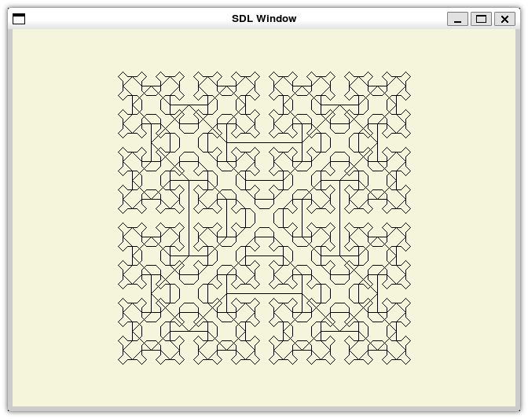

# SPL to WASM

Welcome to the SPL to WebAssembly Compiler project! This compiler is designed to compile
code written in the Simple Programming Language (SPL) to WebAssembly, JavaScript, and x86 assembly, 
with the goal of enabling efficient portable execution of SPL programs across different platforms.

<table>
    <tr>
        <th>Sierpinski on JavaScript/WebAssembly target</th>
        <th>Sierpinski on x86 target</th>
    </tr>
    <tr>
        <td>
            
        </td>
        <td>
            
        </td>
    </tr>
</table>

## Supported targets

The following targets are supported:
- WebAssembly
- JavaScript (Browser and Node.js)
- x86

## Setup

This project is written in Java 21 and relies on the [Gradle build tool](https://gradle.org/)
for packaging and library management. It is recommended to use [IntelliJ](https://www.jetbrains.com/idea/)
when working with the source code. To get started, simply clone this repository, launch IntelliJ
and open the cloned directory as a project. The IDE should automatically detect that a Gradle project
is present.

To generate a jar file containing all libraries, run the `shadowJar` task. This can also be done outside
an IDE by executing `gradlew shadowJar` (make sure the build script for your respective operating system
is marked as executable).

## CLI usage
```
Usage: splc [-hV] [--headless] [-o=<output>] -t=<target> <input>
      <input>             Source code file to compile.
  -h, --help              Show this help message and exit.
      --headless          Disable rendering procedures.
  -o, --output=<output>   File to write output to.
  -t, --target=<target>   The target to generate code for (JS, NODEJS, WASM,
                            X86).
  -V, --version           Print version information and exit.
```

Example: `jar -jar splc.jar myprogram.spl --target wasm`

## Compiling the WebAssembly output

The WebAssembly code generator emits code in its textual representation. Before it can be executed by the
browser, it has to be translated to its binary representation. This can easily be done by using the `wat2wasm`
tool from the [WebAssembly binary toolkit](https://github.com/WebAssembly/wabt). Simply download the latest release
for your operating system. `wat2wasm` can be found in the `bin` directory. It is recommended to add it to your
system's path variable.

To compile the example from above, use the following command `wat2wasm --enable-threads myprogram.wat`.

## Compiling the x86 output

The x86 code generator emits 64-bit assembly for the [NASM](https://www.nasm.us/) assembler. Programs generated
by the compiler depend on `libc` and the [SPL standard library](std/x86/stdlib.c) written in C (This compiler implements
this [System V AMD64 ABI](https://en.wikipedia.org/wiki/X86_calling_conventions#Callee-saved_(non-volatile)_registers)
calling convention to allow interoperability with C code). [SDL2](https://www.libsdl.org/) is used to implement SPL's 
rendering procedures. Linking against `libc` and the standard library can, for
example, be accomplished using [GCC](https://gcc.gnu.org/).
Use the following commands to assemble and link a program:
1. Install SDL2: `sudo apt install libsdl2-dev` (Ubuntu/Debian)
2. Compile the standard library: `gcc -c stdlib.c`
3. Compile the program assembly: `nasm -f elf64 mypogram.asm -o myprogram.o`
4. Link program and standard library: `gcc myprogram.o stdlib.o -o myprogram -lSDL2 -no-pie`

Run it using `chmod +x myprogram && ./myprogram`.

## Rendering procedures on Node.js target

When targeting Node.js and headless mode being disabled, JavaScript programs generated by the compiler will depend
on [@kmamal/sdl](https://www.npmjs.com/package/@kmamal/sdl) and [canvas](https://www.npmjs.com/package/canvas). These
libraries can be installed using `npm install @kmamal/sdl canvas`.

## Headless mode

When the `--headless` option is passed to the compiler, rendering procedures will be disabled. Dependencies on the
respective rendering libraries will be dropped. Additionally, the x86 standard library has to be compiled with
the `HEADLESS` define present (`gcc -c stdlib.c -DHEADLESS`).


## Using the web playground

This project includes a playground that can be used to run both WebAssembly and JavaScript files generated
by the compiler, which can be found in the [web](web) directory. It requires [Node.js](https://nodejs.org/en)
to be installed on your system. To run it, follow the steps below.
1. Make sure Node.js is installed. Both latest and LTS should work.
2. CD into the static directory (`cd web/static`).
3. Install required libraries and compile the website (`npm i && npm run build`).
4. CD back into the web directory (`cd ..`).
5. Install required libraries for the server and run it (`npm i && node .`)
6. A webserver should now be available on http://localhost:3000.
7. On the website, select either a JavaScript or a WebAssembly file generated by the compiler.